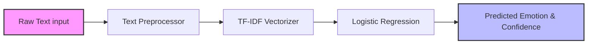
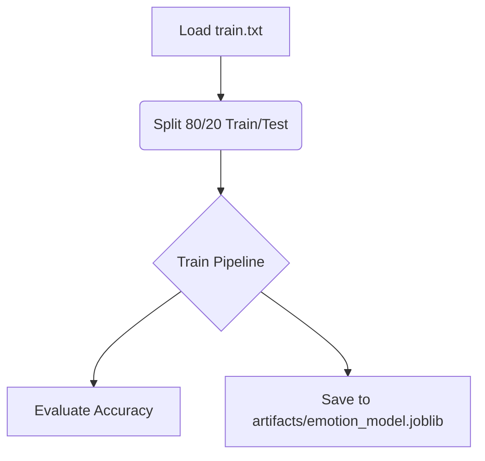
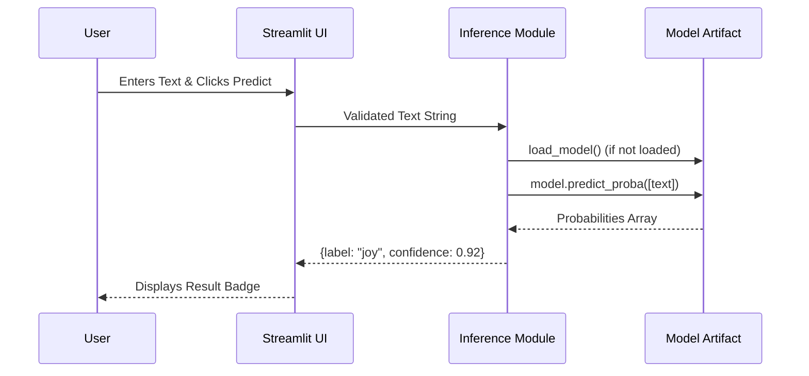

<div align="center">

# 🧠 Emotion Classification Pipeline & Streamlit App

[](https://www.python.org/downloads/)
[](https://scikit-learn.org/)
[](https://streamlit.io/)
[](https://docs.pytest.org/en/latest/)

*A deployable NLP project featuring a custom-trained text-classification pipeline, a Streamlit front-end for real-time inference, and free-hosting deployment support through Streamlit Community Cloud.*

</div>

---

## 📖 Overview

This project transforms a notebook-based NLP exploration (`NLP_NEW.ipynb`) into a robust, modular, and deployable application. It implements an **Emotion Classification** model that predicts the dominant emotion of a given sentence.

The project is designed to be:
*   **Reproducible**: A standalone training script (`train_model.py`) standardizes the dataset preprocessing and model training.
*   **Modular**: Inference logic (`predict.py`) is decoupled from the user interface (`app.py`), allowing the model to be easily integrated into other systems.
*   **Deployable**: Optimized for rapid deployment on Streamlit Community Cloud, prioritizing fast startup times by relying on a serialized model artifact rather than retraining on boot.

Whether you are a recruiter evaluating NLP software engineering practices, a developer looking to contribute, or a student learning how to build and deploy ML models, this repository provides a clear, end-to-end example.

---

## ✨ Features

- **End-to-End Pipeline**: Train, serialize, and infer from a unified codebase.
- **Custom Text Preprocessing**: Handles lowercasing, punctuation removal, digit removal, ASCII filtering, and NLTK-based stopword removal.
- **Efficient Serialization**: Uses `joblib` to save and load the `scikit-learn` Pipeline (TF-IDF + Logistic Regression).
- **Interactive Web UI**: A clean, responsive Streamlit dashboard for single-text predictions with confidence scoring.
- **Test-Driven Design**: Includes `pytest` suites covering training logic, inference edge cases, and UI helper functions.

---

## 🛠️ How It Works

### 1. Preprocessing & Feature Extraction

Before training, raw text from `train.txt` undergoes strict preprocessing:
1.  **Lowercasing**: Standardizes text case.
2.  **Punctuation Stripping**: Removes characters like `!`, `?`, `,`.
3.  **Digit Removal**: Strips numerical values to focus on semantic words.
4.  **ASCII Filtering**: Ensures only standard ASCII characters are processed.
5.  **Stopword Removal**: Utilizes `nltk.corpus.stopwords` to remove common, low-value English words (e.g., "the", "is", "at").

After cleaning, the text is vectorized using **TF-IDF (Term Frequency-Inverse Document Frequency)**, which transforms the text into numerical feature vectors representing the importance of words relative to the dataset.

### 2. Model Architecture

The project utilizes a `scikit-learn` `Pipeline` consisting of two main stages:



*   **Vectorizer**: `TfidfVectorizer` (with the custom preprocessor attached).
*   **Classifier**: `LogisticRegression(max_iter=1000)`.

### 3. Training Workflow

The training script (`train_model.py`) orchestrates the following:



### 4. Inference Workflow

The application (`app.py` -> `predict.py`) loads the serialized pipeline to generate predictions instantly:



---

## 📁 Project Structure

```text
├── app.py                 # Streamlit UI application
├── predict.py             # Inference logic and model loading
├── train_model.py         # Model training and serialization script
├── train.txt              # Dataset (Text ; Emotion)
├── NLP_NEW.ipynb          # Original exploratory Jupyter Notebook
├── requirements.txt       # Python dependencies
├── README.md              # Project documentation
├── artifacts/             # Directory for saved model files
│   └── emotion_model.joblib # Serialized scikit-learn pipeline (generated)
├── tests/                 # Pytest test suite
│   ├── conftest.py
│   ├── test_app.py
│   ├── test_predict.py
│   ├── test_project_scaffold.py
│   └── test_train_model.py
└── docs/                  # Design specs and planning docs
```

---

## 🚀 Setup and Installation

### Prerequisites
*   Python 3.10+

### Local Installation

1. **Clone the repository:**
   ```
   git clone https://github.com/YOUR_USERNAME/Sentiment_analysis.git
   cd Sentiment_analysis
   ```

2. **Create and activate a virtual environment (recommended):**
   ```
   python3 -m venv venv
   source venv/bin/activate  # On Windows: venv\Scripts\activate
   ```

3. **Install dependencies:**
   ```
   python3 -m pip install -r requirements.txt
   ```

---

## 💻 Usage

### 1. Train the Model

Before running the app or inference tests, you must train the model to generate the `.joblib` artifact.

```
python3 train_model.py
```
**Expected Output:**
```
Saved model to artifacts/emotion_model.joblib
Accuracy: 0.8638
```

### 2. Run the Test Suite

Verify the integrity of the preprocessing, training, and inference logic.

```
python3 -m pytest -v
```

### 3. Launch the Streamlit App

Start the interactive web interface.

```
python3 -m streamlit run app.py
```
*The app will automatically open in your default browser at `http://localhost:8501`.*

---

## ☁️ Deployment

This project is structured for immediate deployment on **Streamlit Community Cloud**.

### GitHub Push
Ensure your local `main` branch is pushed to GitHub, including the `artifacts/emotion_model.joblib` file.

### Streamlit Community Cloud
1. Go to [share.streamlit.io](https://share.streamlit.io).
2. Sign in with your GitHub account.
3. Click **Create app**.
4. Select your repository, branch (`main`), and set the main file path to `app.py`.
5. Select a Python version (e.g., 3.11).
6. Click **Deploy**.

---

## 🚧 Limitations & Future Improvements

While this project provides a solid foundation for deploying NLP models, there is always room for growth:

*   **Model Complexity**: Currently uses Logistic Regression with TF-IDF. **Future Improvement**: Transition to deep learning architectures (e.g., LSTMs) or transformer-based models (e.g., DistilBERT) for higher accuracy and context awareness.
*   **OOTV (Out-of-Vocabulary) Handling**: TF-IDF struggles with words it hasn't seen during training. **Future Improvement**: Utilize pre-trained word embeddings (Word2Vec, GloVe).
*   **Batch Inference**: The current UI only supports single-sentence prediction. **Future Improvement**: Add CSV upload functionality to `app.py` for batch processing.
*   **Data Imbalance**: Emotion datasets are often skewed. **Future Improvement**: Implement SMOTE or class weighting during training in `train_model.py`.
